# システムアーキテクチャ図

## 高レベルアーキテクチャ

## フロントエンドアーキテクチャ

## バックエンドアーキテクチャ

## データフロー図

### チャット処理フロー

### 設定更新フロー

### ナレッジ管理フロー

## コンポーネント関係図

```mermaid
graph LR
    subgraph "フロントエンド"
        FE[フロントエンド]
        CI[ChatInterface]
        LCS[LLMConfigSettings]
        KM[KnowledgeManagement]
    end
    
    subgraph "バックエンドAPI"
        BE[バックエンド]
        CR[ChatRoutes]
        LCR[LLMConfigRoutes]
        KR[KnowledgeRoutes]
        CFR[ConfigRoutes]
    end
    
    subgraph "バックエンドサービス"
        CS[ChatService]
        QS[QdrantService]
        CMS[ConfigManagerService]
    end
    
    subgraph "コアモジュール"
        CM[ConfigManager]
        QM[QdrantManager]
        UT[Utils]
    end
    
    subgraph "データストア"
        QB[Qdrant]
        CF[設定ファイル]
    end
    
    subgraph "外部サービス"
        LLM[LLM API]
        OL[Ollama]
    end
    
    CI --> CR
    LCS --> LCR
    KM --> KR
    FE --> BE
    
    CR --> CS
    LCR --> CMS
    KR --> QS
    CFR --> CMS
    
    CS --> CM
    CS --> QM
    QS --> QM
    CMS --> CM
    
    CM --> CF
    QM --> QB
    
    CS --> LLM
    QS --> OL
```

## デプロイアーキテクチャ

## 開発環境アーキテクチャ

これらのアーキテクチャ図は、システムの構造、データフロー、コンポーネント間の関係を視覚的に表現しています。各図は特定の側面に焦点を当てており、システム全体を理解するのに役立ちます。