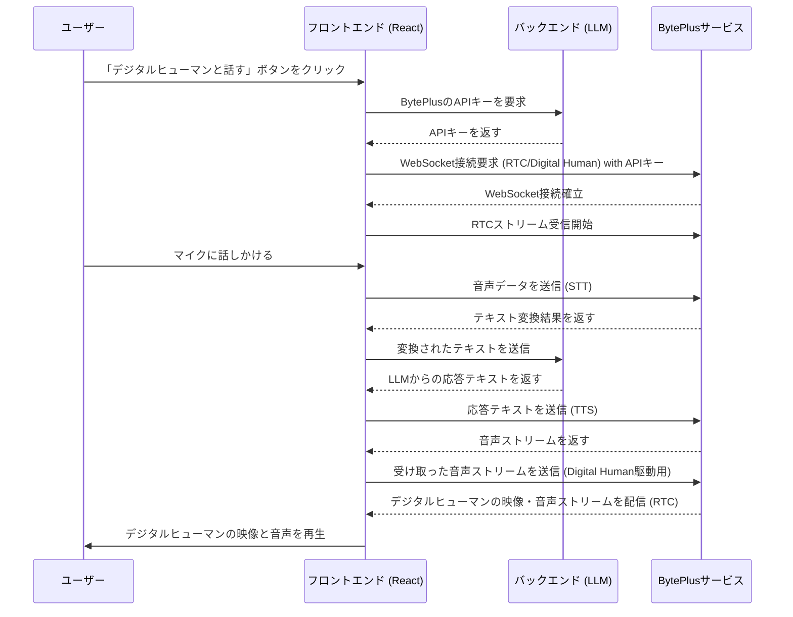

# デジタルヒューマン機能 機能仕様書

## 1. 目的

本ドキュメントは、[製品要求仕様書(PRD)](docs/prd_digital_human.md)に基づき、デジタルヒューマン機能の具体的な技術仕様、コンポーネント設計、処理フローを定義することを目的とします。

## 2. 全体アーキテクチャ

## 3. フロントエンド (React)

### 3.1. 担当範囲

-   UIコンポーネントの実装
-   BytePlusサービスとのWebSocket通信
-   BytePlus RTC SDKの統合とストリームの描画
-   ユーザーの音声入力処理
-   バックエンドへのAPIキー要求
-   **設定画面でのBytePlus認証情報管理**

### 3.2. 主要コンポーネント

-   **`DigitalHumanButton.tsx`**
    -   役割: デジタルヒューマンの表示/非表示を切り替えるボタン。
    -   状態: `isDigitalHumanVisible`
-   **`DigitalHumanView.tsx`**
    -   役割: デジタルヒューマンの映像を描画するコンポーネント。
    -   内部でBytePlus RTC SDKを利用し、受け取ったストリームを`<video>`要素にバインドする。
-   **`useBytePlus.ts` (カスタムフック)**
    -   役割: BytePlusサービスとの通信ロジックをカプセル化する。
    -   **`connect(apiKey)`**: WebSocket接続を確立し、認証を行う。
    -   **`disconnect()`**: WebSocket接続を切断する。
    -   **`sendAudioData(data)`**: ユーザーの音声データをSTTサービスに送信する。
    -   **`sendTextForTTS(text)`**: LLMの応答テキストをTTSサービスに送信する。
    -   **`driveDigitalHuman(audioStream)`**: TTSから受け取った音声ストリームをデジタルヒューマンの駆動用に送信する。

### 3.3. 通信仕様 (WebSocket)

-   **接続先URL**: `wss://rtc.byteplusapi.com/ws/v2` (仮)
    -   ※ `BytePlus Digital Human POC (for CloudOne） .md` に記載のURLを正式なものとする。
-   **認証**:
    -   接続時に `CTL` フレームを送信し、認証情報を渡す。
    -   `appid`, `token` はバックエンドから取得したものを使用する。
-   **メッセージ形式**:
    -   [数字人交互 Websocket 通信协议-外部.md](docs/数字人交互%20Websocket%20通信协议-外部.md) に定義されたJSON形式のフレーム (`CTL`, `DAT`, `MSG`) に従って通信を行う。

## 4. 処理フロー詳細

### 4.1. 初期化シーケンス

1.  ユーザーが `DigitalHumanButton` をクリックする。
2.  バックエンドにAPIリクエストを送信し、BytePlusの `appid` と `token` を取得する。
3.  取得したキーを引数として `useBytePlus` フックの `connect()` 関数を呼び出す。
4.  WebSocket接続を確立し、認証情報を送信する。
5.  BytePlus RTCからメディアストリーム (`MediaStream`) を受信する。
6.  `DigitalHumanView` コンポーネント内の `<video>` 要素の `srcObject` に受信したストリームを設定し、再生を開始する。

### 4.2. 対話シーケンス

1.  ユーザーがマイクに向かって発話を開始する。
2.  `navigator.mediaDevices.getUserMedia` を使用してマイクから音声データを取得する。
3.  取得した音声データを `useBytePlus` フックの `sendAudioData()` 経由でBytePlus STTサービスに送信する。
4.  STTサービスからリアルタイムで返されるテキスト変換結果を受け取る。
5.  発話が終了したと判断された時点で、最終的なテキストをバックエンド（LLM）に送信する。
6.  バックエンドからLLMの応答テキストを受け取る。
7.  応答テキストを `useBytePlus` フックの `sendTextForTTS()` 経由でBytePlus TTSサービスに送信する。
8.  TTSサービスから返される音声ストリームを受け取る。
9.  受け取った音声ストリームを `driveDigitalHuman()` 経由でBytePlus Digital Humanサービスに送信する。
10. Digital Humanサービスが音声を基にリップシンクを生成し、RTCストリームを通じて映像と音声をクライアントに配信する。
11. `DigitalHumanView` が更新されたストリームを再生する。

## 5. 参照ドキュメント

-   [製品要求仕様書(PRD)](docs/prd_digital_human.md)
-   [BytePlus Digital Human POC (for CloudOne） .md](docs/BytePlus%20Digital%20Human%20POC%20(for%20CloudOne%EF%BC%89%20.md)
-   [数字人交互 Websocket 通信协议-外部.md](docs/数字人交互%20Websocket%20通信协议-外部.md)
-   [20250622_voice_repliation_test.md](docs/20250622_voice_repliation_test.md)
-   `example/QuickStart_React_BytePlus_4.66_16/`

## 6. 既存コードへの統合

本機能を既存の `frontend` アプリケーションに統合するため、以下のファイルを修正します。

### 6.1. `frontend/src/pages/ChatPage.tsx`

-   **修正内容**:
    -   `DigitalHumanButton` をレンダリングするロジックを追加します。
    -   デジタルヒューマン表示状態 (`isDigitalHumanVisible`) を管理するstateを追加します。
    -   `isDigitalHumanVisible` が `true` の場合に `DigitalHumanView` を表示します。

### 6.2. `frontend/src/components/Layout.tsx`

-   **修正内容**:
    -   デジタルヒューマン表示エリアを考慮したレイアウト調整を行います。チャット画面とデジタルヒューマン画面が共存できるように、画面分割やオーバーレイ表示などのレイアウト変更を加えます。

### 6.3. `frontend/src/hooks/useChatPageState.ts`

-   **修正内容**:
    -   デジタルヒューマン機能に関連する状態（マイクの状態、接続状態など）を一元管理するためのstateとロジックを追加します。

### 6.4. 新規作成ファイル

-   `frontend/src/components/DigitalHuman/`
    -   `DigitalHumanButton.tsx`
    -   `DigitalHumanView.tsx`
    -   `MicrophoneButton.tsx`
-   `frontend/src/hooks/useBytePlus.ts`

## 7. バックエンド

### 7.1. 担当範囲

-   **役割**:
    1.  フロントエンドからの要求に応じて、BytePlusの認証情報 (`appid`, `token`) を安全に提供する。
    2.  フロントエンドからSTT（音声認識）によってテキスト化されたユーザーの質問を受け取り、既存のLLMに転送して応答テキストを生成し、フロントエンドに返す。
-   **改修範囲**:
    -   **設定更新ロジック**: 既存の `/api/v1/config/update` エンドポイントで、`section='byteplus'` のリクエストを処理できるようにする。`config.toml` に値が書き込まれることを確認する。
    -   **新規APIエンドポイント**: `/api/v1/digitalhuman/config` (仮) のようなエンドポイントを新設し、`config.toml` から読み取ったBytePlusの認証情報を返す。
    -   既存のチャットAPIエンドポイントはそのまま利用する。

## 8. 認証情報管理

-   **方針**: BytePlusの認証情報 (`appid`, `token`) は、バックエンドの `config.toml` で管理する。これらの値は、アプリケーションの**設定画面から動的に設定・更新できる**ものとする。
-   **設定フロー**:
    1.  管理者はフロントエンドの設定画面を開き、「BytePlus設定」セクションに `appid` と `token` を入力して保存する。
    2.  フロントエンドは `useConfig` フックの `updateConfig` 関数を呼び出し、バックエンドに `{ section: 'byteplus', field: 'appid', value: '...' }` のようなリクエストを送信する。
    3.  バックエンドは受け取った値で `config.toml` を更新する。このロジックは既存の設定管理機能で対応する。
-   **利用フロー**:
    1.  フロントエンドは、デジタルヒューマン機能の利用開始時に、バックエンドの `/api/v1/digitalhuman/config` エンドポイントにリクエストを送信する。
    2.  バックエンドは `config.toml` から現在の `appid` と `token` を読み出し、フロントエンドに返す。
    3.  フロントエンドはその認証情報を使ってBytePlusサービスとの接続を確立する。